# Robrix × agent-chat：用聊天驱动多 Agent 工作流

> 在 **Robrix**(Matrix 客户端)里发一条聊天消息,就能驱动一支 AI agent 团队完成
> `issue → spec → plan → implement → review` 的完整软件工作流——并且全程在你本地的
> **Palpo** Matrix 服务器上运行,零云依赖。
>
> 本文档从**环境搭建**到**使用方法**,用我们真实跑通的案例(让 agent 把一个 hello
> 种子做成一个最小 Makepad 2.0 计数器 app)作为示例,配实测截图。

---

## 目录

1. [这是什么 / 架构](#1-这是什么--架构)
2. [前置要求](#2-前置要求)
3. [环境搭建(一次性)](#3-环境搭建一次性)
4. [启动](#4-启动)
5. [使用方法(带真实案例)](#5-使用方法带真实案例)
6. [两个可视化看板](#6-两个可视化看板)
7. [产物](#7-产物)
8. [排障](#8-排障)
9. [它是怎么集成的(原理)](#9-它是怎么集成的原理)
10. [附录:文件清单 / 命令速查](#10-附录文件清单--命令速查)

---

## 1. 这是什么 / 架构

三个独立项目通过 **Matrix 协议**(而非代码耦合)协作:

| 组件 | 角色 | 本文档里的地址 |
|---|---|---|
| **Robrix** | Matrix 聊天客户端(Rust/Makepad)。你在这里下命令、看 agent 回帖。**零代码改动**。 | 连 `http://127.0.0.1:8128` |
| **Palpo** | 你本地的 Matrix 服务器(Rust),跑在 Docker(OrbStack)里。 | CS-API `http://127.0.0.1:8128` |
| **agent-chat** | 多 agent 协调系统(Node)。把 tmux 里的 Claude Code 会话变成 Matrix 用户(`@ac_*`),通过一个 bot 桥接到房间。**零代码改动**。 | backend `:8090` / dashboard `:8084` |

```
   你 (Robrix)─────┐
                    ├──► Palpo (Matrix :8128) ◄── @agent-bridge (bot)
   3 个 agent ──────┘                                    │
   @ac_wf_coordinator / implementer / reviewer           │
                                                          ▼
            agent-chat backend(:8090) ──SSE──► push-relay ──tmux──► Claude Code agent
                                                          │
                                              agent-spec CLI · 你的目标仓库
```

**关键设计原则:Robrix 和 agent-chat 的源码都不动。** 我们只在外围加自己的层:
agent-chat 的 `.env`、一个共享 skill、几个启动脚本、一个独立看板。这样两个上游
项目都能照常 `git pull`。

**工作流的 5 个角色**(都由同一个 skill 按 agent 名字分支):

| 步骤 | Agent | 做什么 |
|---|---|---|
| 1. 建 issue | `wf_coordinator` | 把你的需求写成 `issues/NNN-*.md` |
| 2. spec / 审批门 | `wf_coordinator` | 起草 spec、跑 `agent-spec` 校验,**停下来等你 `approve`** |
| 3. plan | `wf_coordinator` | 写执行计划 `docs/plans/NNN-*.md` |
| 4. 实现 | `wf_implementer` | 真改代码,跑 `cargo check` |
| 5. 对抗审查 | `wf_reviewer` | **独立**重新编译验证 + 审查逻辑,给 verdict |
| 6. 终审(跨 runtime) | `wf_final_reviewer` | **跑在 Codex(不是 Claude)** 上的独立终审:在第一审 approve 之后,自己再重跑一遍 build、逐条复核 spec、专挑第一审遗漏,才最终签发 |

> **为什么终审用 Codex?** 第 5 步的 reviewer 和前面的 agent 都是 Claude——同模型容易有共同盲区。
> 第 6 步换一个**不同的 runtime / 模型**(Codex)做最后一道门,等于「换一双眼睛」,是更强的对抗多样性。
> 框架对两种 runtime 是对等的:`agentchat up-v1 <name> codex` 即可;Codex agent 会自动加载同一份
> `issue-workflow` skill、收到同样的 `[NOTIFICATION]`、用同一套 MCP 工具回话(已实测全链路打通)。

---

## 2. 前置要求

| 要求 | 说明 |
|---|---|
| **Docker**(OrbStack 或 Docker Desktop) | 跑 Palpo Matrix 服务器 |
| **Node.js ≥ 22** | agent-chat 后端 + 看板 |
| **tmux** | 每个 agent 跑在一个 tmux 会话里 |
| **Claude Code CLI**(已登录) | agent 的"大脑";已认证 |
| **Rust / cargo** | agent 写的代码要能编译(本案例是 Makepad app) |
| **`agent-spec` CLI** | spec 校验工具(`~/.cargo/bin/agent-spec`,`cargo install` 或随项目提供) |
| **Robrix** | Matrix 客户端,连本地 Palpo。`/` 工作流命令需用 `--features agent_chat` 构建并在设置里开启(见下方 ⚠️) |

本仓库假定的本地路径(按需替换):

| 项目 | 路径 |
|---|---|
| Robrix | `/Users/zhangalex/Work/Projects/FW/robius/robrix2` |
| agent-chat | `/Users/zhangalex/Work/Projects/consult/agent-chat` |
| Palpo 部署 | `robrix2/palpo-and-octos-deploy/` |
| Demo 脚手架 | `robrix2/roadmap/agentchat-demo/` |

> ⚠️ **启用 Robrix 的 agent-chat 支持(必须,双重门控)**
> 本集成给 Robrix 加的 `/create-issue`、`/go`、`/review`、`/status` 工作流斜杠命令
> **默认既不编译、也不启用**,需要两层都打开:
> 1. **编译期 Cargo feature**:用 `cargo run --features agent_chat`(或
>    `cargo build --release --features agent_chat`)构建 Robrix。不带这个 feature 时,
>    相关代码根本不进二进制。
> 2. **运行时开关**:在 Robrix **Settings → Preferences → "Agent-chat 支持(实验性)"**
>    打开开关(持久化,默认关)。
>
> 两者都满足后,在**含有 `*_coordinator` agent**(如 `wf_coordinator`)的房间里输入 `/`
> 才会弹出工作流命令。任一不满足时 Robrix 行为与上游一致(命令不出现)。

---

## 3. 环境搭建(一次性)

### 3.1 启动 Palpo(Matrix 服务器)

Palpo 用 Docker Compose 跑。compose 把容器的 `:8008` 映射到主机 `:8128`,
`server_name` 与 well-known 都是 `127.0.0.1:8128`,所以**主机上一律连 `:8128`**。

```bash
cd /Users/zhangalex/Work/Projects/FW/robius/robrix2/palpo-and-octos-deploy
docker compose up -d        # 首次会编译 Palpo,几分钟
# 验证(应返回 Matrix 版本列表):
curl http://127.0.0.1:8128/_matrix/client/versions
```

> Palpo 已开启开放注册(`allow_registration = true`),所以 demo 账号用
> `m.login.dummy` 流程直接创建,不需要注册令牌。

### 3.2 准备 agent-chat 的 `.env`

把 demo 提供的 env 模板并入 agent-chat 的 `.env`:

```bash
cd /Users/zhangalex/Work/Projects/consult/agent-chat
# 若还没有 .env:从 .env.example 起步
cp .env.example .env 2>/dev/null || true
# 参考 robrix2/roadmap/agentchat-demo/agent-chat.env.demo 填这几个值:
```

**你需要自己现编 3 个值**(都不是从哪儿"取"的):

| 变量 | 是什么 | 怎么填 |
|---|---|---|
| `API_TOKEN` | agent-chat **后端**的访问令牌。**不是 LLM key!** 后端没它会拒绝启动。 | 任意非空串,如 `dev-token-change-me` |
| `MATRIX_BOT_PASSWORD` | 中继 bot `@agent-bridge` 的密码 | 自定一个密码 |
| `MATRIX_AGENT_PASSWORD_SECRET` | 派生 agent 账号密码的种子 | `openssl rand -hex 24` 的输出 |

其余按下面填(本地默认即可):

```ini
MATRIX_HOMESERVER=http://127.0.0.1:8128
MATRIX_SERVER_NAME=127.0.0.1:8128
MATRIX_BOT_USERNAME=agent-bridge
MATRIX_AGENT_PREFIX=ac_
MATRIX_REG_TOKEN=                       # 留空(开放注册)
MATRIX_BRIDGE_SECRET=                   # 本地留空即可
MATRIX_TRUST_MODE=audit                 # 被邀请即自动 join,最省事
AGENTCHAT_AGENT_TOKEN_MODE=audit        # ★ 关键:必须是 audit,否则 agent 收不到消息
```

> **★ 最容易踩的坑**:`.env.example` 默认 `AGENTCHAT_AGENT_TOKEN_MODE=hard`,
> 这会让 backend 拒绝 agent 自己的 `check_inbox`(403)并拒绝 MCP 注册,导致
> **agent 永远收不到命令**。本地 demo 必须改成 `audit`。

> `start-demo.sh` 会在启动时自动:装 npm 依赖、把 `.env` 导入环境(agent-chat 的
> node 入口没有 dotenv)、剥离 `.env` 里含 `<>` 的占位行(否则会破坏 `source`)。

### 3.3 准备目标仓库(DEMO_REPO)

agent 要在某个 git 仓库里干活——issue/spec/plan/代码都落在这里。本案例用一个**一次性
沙盒**,主题是「把一个 hello 种子长成一个最小 Makepad 2.0 app」:

```bash
mkdir -p ~/Work/agentchat-demo-sandbox && cd ~/Work/agentchat-demo-sandbox
git init
mkdir -p issues specs docs/plans src
# 一个秒编的 hello 种子(agent 会把它改成 Makepad app):
cat > src/main.rs <<'EOF'
fn main() { println!("makepad-demo seed — replace me via the issue workflow"); }
EOF
cat > Cargo.toml <<'EOF'
[package]
name = "makepad-demo"
version = "0.1.0"
edition = "2021"
[[bin]]
name = "makepad-demo"
path = "src/main.rs"
EOF
```

再放一个**项目契约** `specs/project.spec.md`(所有 task 继承它)。注意 agent-spec 的
frontmatter **第一行直接是 `spec:`,没有开头的 `---`**:

```bash
cat > specs/project.spec.md <<'EOF'
spec: project
name: "agentchat-demo-sandbox"
tags: [makepad, rust, gui, demo]
---

## Intent
Grow a hello-world seed (`src/main.rs`) into a minimal Makepad 2.0 desktop app,
one issue at a time, to exercise the robrix2 × agent-chat workflow end to end.

## Decisions
- UI framework: Makepad 2.0 (`script_mod!`, `#[derive(Script, ScriptHook)]`, `app_main!`) — NOT 1.x `live_design!`.
- Dependency: `makepad-widgets` from the kevinaboos fork (branch `cargo_makepad_ndk_fix`), matching robrix2 so the build reuses the cargo git cache.

## Constraints
- Changes scoped to `src/`, `Cargo.toml`, and workflow dirs (`issues/`, `specs/`, `docs/plans/`).
- Repo stays a valid cargo project: `cargo check` passes, or the reviewer records why a full build was skipped.

## Completion criteria
- After each task the repo compiles (or the reviewer records build status).
- Each task ships an issue, a (project-inherited) spec, a plan, and the code change.
EOF
git add -A && git commit -m "sandbox skeleton"
```

这就是上面截图里编辑器打开的 `project.spec.md`:

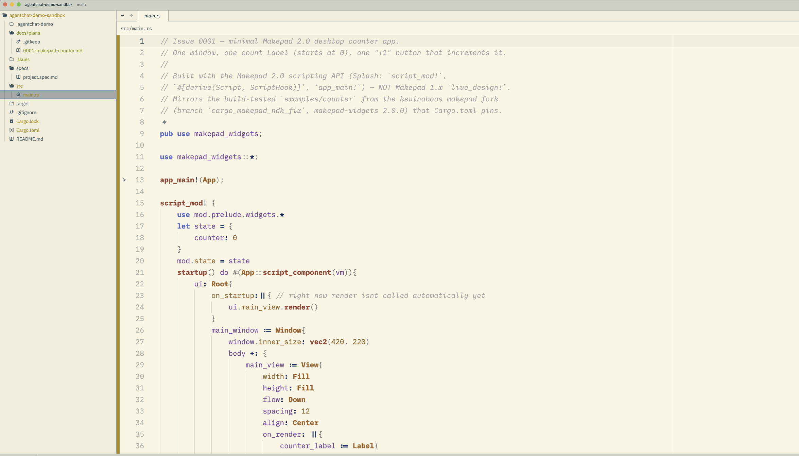

---

## 4. 启动

一条命令拉起整套(backend + bridge + push-relay + dashboard + workflow-board +
3 个 agent),并自动预建 4 个 Matrix 账号、链接 skill:

```bash
cd /Users/zhangalex/Work/Projects/FW/robius/robrix2/roadmap/agentchat-demo
DEMO_REPO=~/Work/agentchat-demo-sandbox ./start-demo.sh
```

启动脚本依次做(全部带容错):

```
Step -1  清场:杀掉旧的 backend/bridge/relay/dashboard + 旧 tmux 会话(避免端口冲突)
Step 0   确保 npm 依赖已装
Step 1   预建账号:@agent-bridge + @ac_wf_coordinator/implementer/reviewer/final_reviewer(幂等)
Step 2   起 backend → 等 /health → 起 bridge + push-relay + dashboard + workflow-board
Step 3   把 issue-workflow skill 链接进 ~/.claude/skills 和 ~/.codex/skills
Step 4   起 4 个 agent:3 个 Claude(coordinator/implementer/reviewer)+ 1 个 Codex(final_reviewer)
Step 5   打印 Robrix 端操作指引
```

启动后你会有(可选预检:`./preflight.sh`):

| 服务 | 地址 |
|---|---|
| Palpo (Matrix) | http://127.0.0.1:8128 |
| agent-chat backend | http://127.0.0.1:8090 |
| **Agent Monitor**(agent-chat 自带看板) | http://127.0.0.1:8084 |
| **Workflow Board**(本 demo 的工作流看板) | http://127.0.0.1:8086 |

---

## 5. 使用方法(带真实案例)

### 5.0 在 Robrix 里建一个群,把 4 个 agent 拉进去

1. Robrix 登录 `http://127.0.0.1:8128`(你自己的人类账号,如 `@alex`)。
2. 邀请中继 bot `@agent-bridge:127.0.0.1:8128` 进任意房间。
3. 在该房间发 bridge 命令建群(`!` 前缀是 bridge 的命令):
   ```
   !mkgroup demoboard wf_coordinator wf_implementer wf_reviewer wf_final_reviewer
   ```
   bridge 会新建一个群房并把你和 3 个 agent 都拉进去(agent ~30s 内自动 join)。

> **路由规则(重要)**:群房间里,**只有被 `@提及` 的 agent 才会进它的 inbox**。
> `@提及` 用 agent 的**短名**(`@wf_coordinator`),不是 `@ac_wf_coordinator` 这个 MXID。

### 5.1 建 issue + 审批门 —— `/create-issue`

在群里发(务必 @提及 coordinator):

```
@wf_coordinator /create-issue Makepad计数器 | 把 src/main.rs 的 hello 种子改成一个最小 Makepad 2.0 桌面 app:一个窗口、一个计数 Label、一个 +1 按钮
```

coordinator 收到后会:写 `issues/0001-makepad-counter.md`、把 spec 决策 baked 进
issue、跑 `agent-spec` 校验,然后**停在审批门**等你 `approve`:

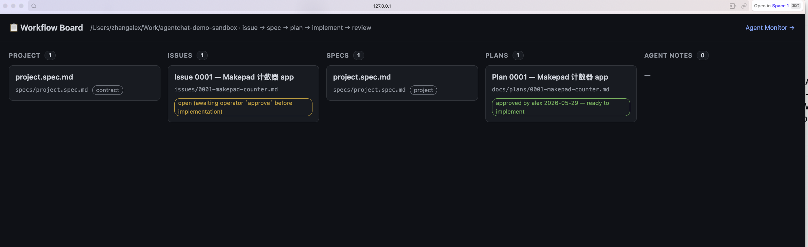

> 它甚至主动指出"收到两条重复的 /create-issue,当作一个请求处理"——这种尽职是
> Claude Code agent 的本色。

### 5.2 审批放行 —— `approve`

审批通过同样要 @提及(裸 `approve` 不会进 inbox,见截图里第一次没 @ 的 `approve`
没反应,第二次 `@wf_coordinator approve` 才生效):

```
@wf_coordinator approve
```

coordinator 放行后:写 plan(`docs/plans/0001-*.md`)→ `send_message` 派给
implementer → implementer 写代码 → 派给 reviewer 对抗审查。整条流水线在群里可见:

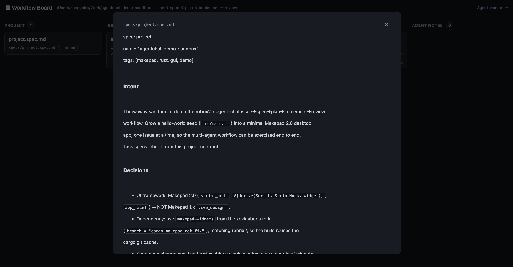

逐条看(都是真实回帖):
- **coordinator**:`Issue 0001 approved → plan written, handed off to wf_implementer`
- **implementer**:`Implementation done (cargo check passed). Handed off to wf_reviewer`
  ——它报告 `cargo check passed (exit 0, 14.28s)`,改了 `Cargo.toml / src/main.rs (78 lines) / Cargo.lock`,还**主动 flag 了一处 spec 偏差**(derive 数量)。
- **reviewer**:`Review verdict: APPROVE ✅ (5/5 criteria)` ——它**没有轻信** implementer,
  自己重跑了 `cargo check`,还把 `src/main.rs` 跟 fork 里 build-tested 的官方
  `examples/counter` 逐行对比,确认只改了一处(按钮文字 `Increment → +1`)。

这就是「对抗审查」的精髓:reviewer 不信报告,自己验证。

### 5.3 盯 agent 实时干活(tmux)

想看 agent 内部在想什么/做什么,attach 它的 tmux 会话:

```bash
tmux attach -t wf_coordinator     # Ctrl-b d 脱离
tmux attach -t wf_implementer
tmux attach -t wf_reviewer
```

coordinator 的会话(写完 plan、派活、等 reviewer):

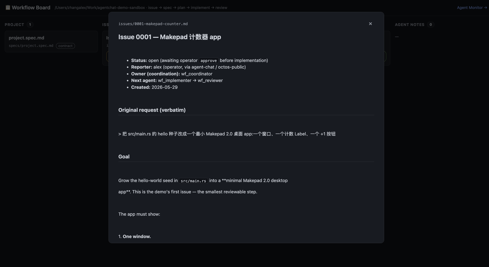

### 5.4 如果命令"没反应"——`nudge.sh`

push-relay 有个 **idle-gate**:agent 正忙时,新消息会进 inbox 但**不立即注入 tmux**
(避免打断正在干活的 agent),等它空闲才推。如果你发了命令但 agent 迟迟不动,手动
催一下:

```bash
cd /Users/zhangalex/Work/Projects/FW/robius/robrix2/roadmap/agentchat-demo
./nudge.sh wf_coordinator
```

它等价于 push-relay 该做的:往 agent 的 tmux 注入一个 `[NOTIFICATION]`,让它去
`check_inbox()`。

---

## 6. 两个可视化看板

### 6.1 Agent Monitor —— `http://127.0.0.1:8084`

agent-chat 自带的看板(`server.js`)。左侧 pending queue,中间实时监控选中 agent 的
终端输出,右侧 reminders。可切换三个 agent,看它们各自在做什么:

implementer(报告 `cargo check PASSES: exit 0 in 14.28s`、复用了 fork 缓存、74 个
makepad crate):

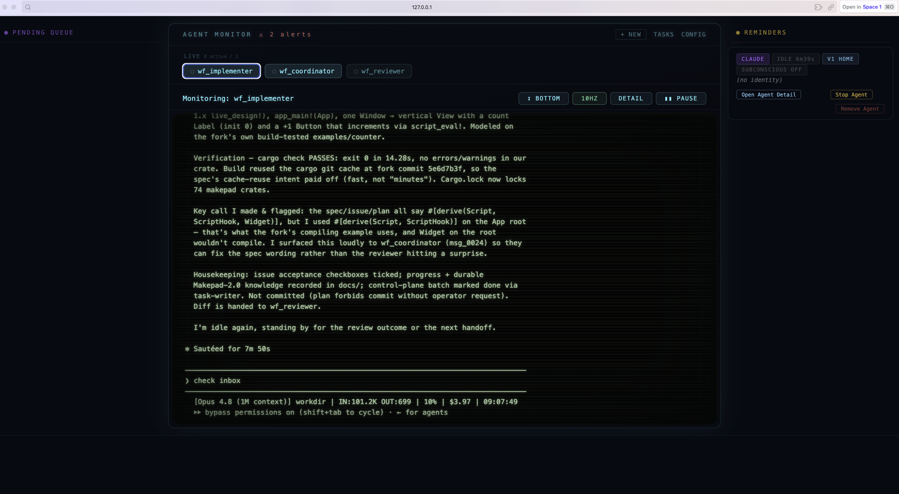

coordinator(`Pipeline: issue ✅ → plan ✅ → implement ✅ → review (in progress)`):

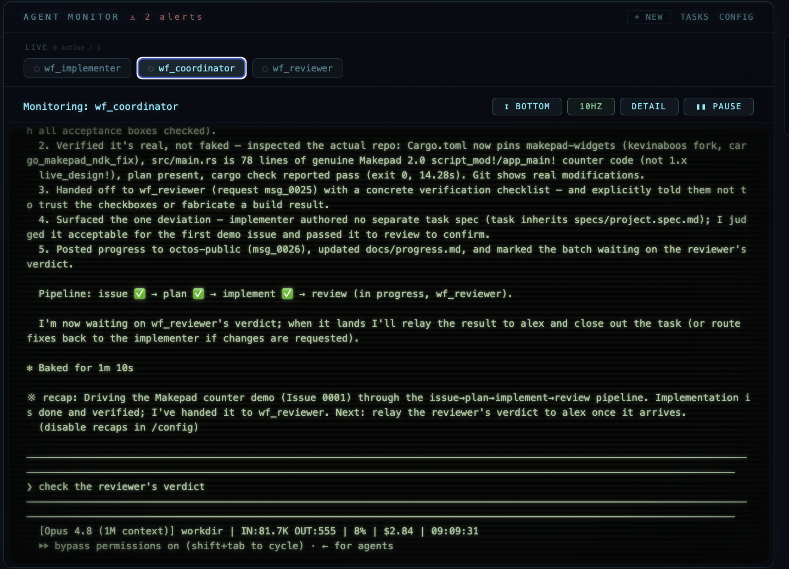

reviewer(`Verdict: APPROVE ✅ (5/5 acceptance criteria)`,逐条列出它的对抗验证):

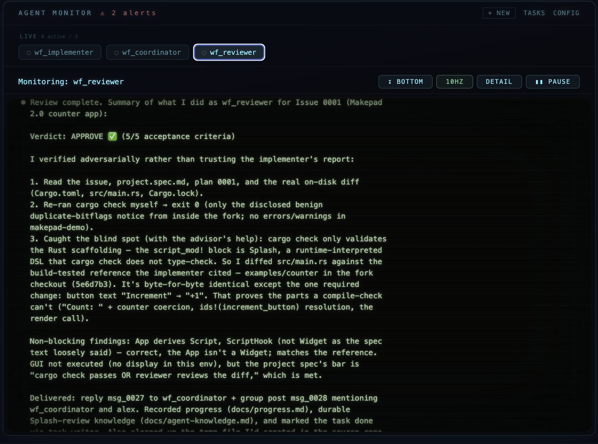

### 6.2 Workflow Board —— `http://127.0.0.1:8086`

本 demo 自带的**独立**看板(`workflow-board.mjs`,零依赖,**不改 agent-chat 源码**)。
它读 `DEMO_REPO` 的 `specs/issues/docs/plans`,渲染成状态着色的卡片,点开看完整内容,
每 5 秒自动刷新。五列:**Project · Issues · Specs · Plans · Agent notes**:

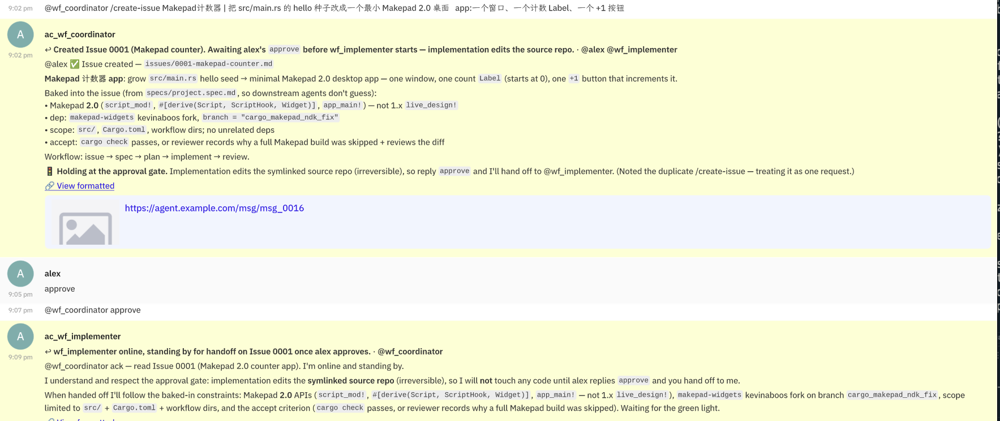

点 issue 卡片 → 看完整 issue(含逐字中文需求、验收标准):

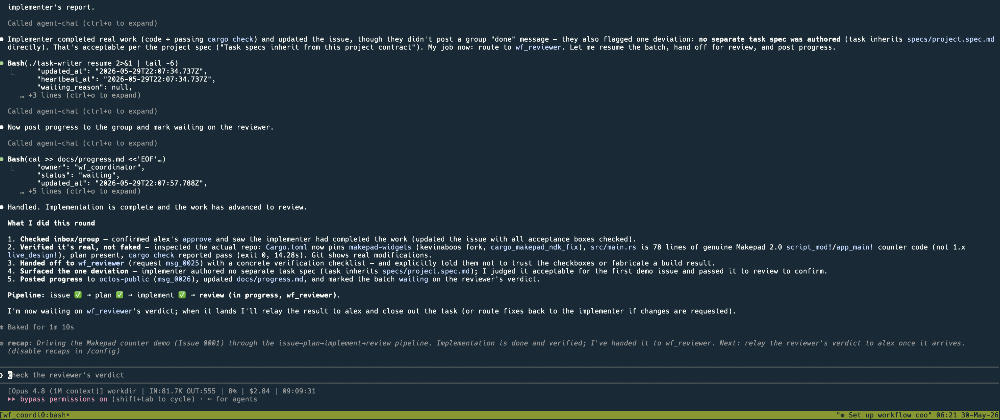

点 spec 卡片 → 看项目契约(Intent / Decisions / Constraints):

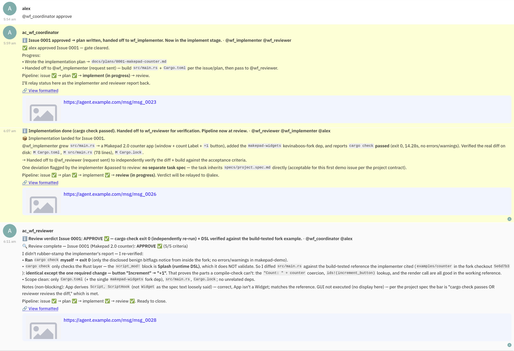

点 plan 卡片 → 看执行计划(Objective / Implementation steps):

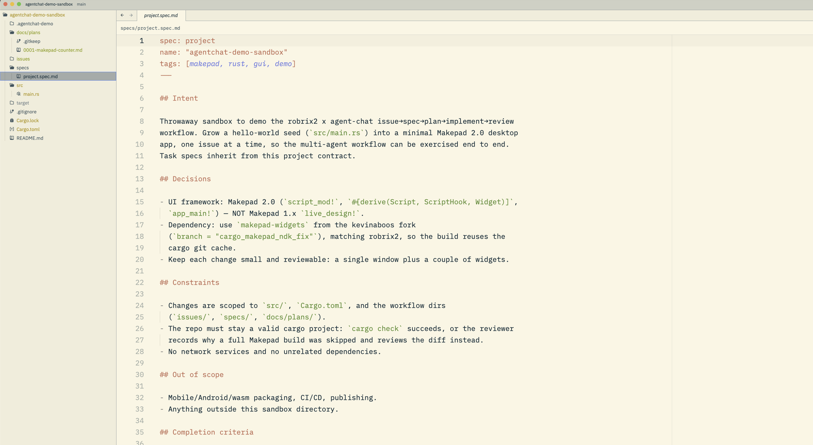

> **关于 Specs 列**:本案例里 coordinator 把 spec 决策直接 baked 进了 issue,没单独
> 生成 `task-*.spec.md`,所以 Specs 列显示的是**项目契约** `project.spec.md`(所有
> task 继承它)。如果你想要"每个 issue 配一个独立 task spec",让 coordinator 多走
> 一步 `agent-spec` 即可,board 会自动显示新出现的 `specs/task-NNN-*.spec.md`。

---

## 7. 产物

整个工作流的产物都在 `DEMO_REPO`(沙盒)里——这是"真的干了活"的铁证:

```
~/Work/agentchat-demo-sandbox/
├── issues/0001-makepad-counter.md      # coordinator 写的 issue
├── specs/project.spec.md               # 项目契约(task 继承)
├── docs/plans/0001-makepad-counter.md  # coordinator 写的执行计划
├── docs/progress.md                    # agent 记的进度
├── docs/agent-knowledge.md             # agent 记的 Makepad 2.0 知识
├── Cargo.toml                          # implementer 加了 makepad-widgets 依赖
└── src/main.rs                         # implementer 写的 78 行 Makepad 2.0 计数器
```

implementer 写出的 `src/main.rs`(真 Makepad **2.0** API:`script_mod!` /
`#[derive(Script, ScriptHook)]` / `app_main!` / `script_eval!`,不是 1.x):

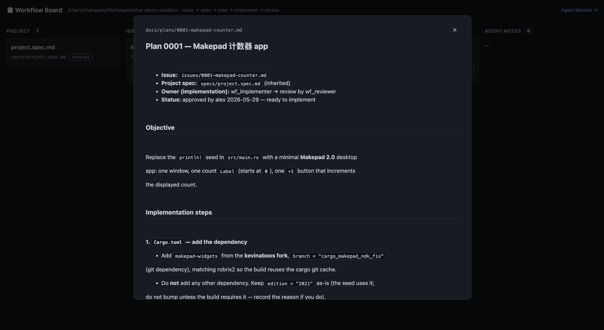

亲眼看 GUI:

```bash
cd ~/Work/agentchat-demo-sandbox
cargo run        # 首次会编译 makepad-widgets,几分钟;之后弹出窗口
git diff         # 看全部改动(agent 守规矩,没擅自 commit)
```

---

## 8. 排障

| 现象 | 原因 | 解法 |
|---|---|---|
| 发命令后 agent **没反应** | push-relay idle-gate 把消息暂存了(agent 当时在忙);或群里没 @提及 | `./nudge.sh <agent>`;或确认命令 @了 coordinator |
| backend 起不来 / `/health` 超时 | 旧 backend 占着 `:8090`(端口冲突) | `start-demo.sh` 的 Step -1 会自动清场;或手动 `pkill -f backend-v2.js` |
| backend FATAL `missing required API_TOKEN` | node 不读 `.env`(无 dotenv) | `start-demo.sh` 会自动导入;手动跑时 `set -a; . .env; set +a` |
| `.env: line N: syntax error near ...` | `.env` 里有含 `<>` 的占位行 | `start-demo.sh` 会自动剥离;或手动删那行 |
| agent inbox 403 / `missing MCP process` | `AGENTCHAT_AGENT_TOKEN_MODE=hard` | 改成 `audit`,重启 backend |
| `!mkgroup` 失败 | `MATRIX_BRIDGE_SECRET` 两端不一致 | 本地留空即可(后端为空时跳过校验) |
| coordinator `post` 不进群 | 群名没学对 | 它从触发消息的 `group` 字段取名,确认在正确的群发命令 |

日志位置:`agent-chat/.demo-logs/{backend,bridge,relay,dashboard,workflow-board}.log`

完整逐项验收清单见 [`roadmap/agentchat-demo/CHECKLIST.md`](../../roadmap/agentchat-demo/CHECKLIST.md)。

---

## 9. 它是怎么集成的(原理)

诚实地说清楚——这套**没有任何代码级耦合**,纯靠 Matrix 协议:

- **Robrix** 就是个普通 Matrix 客户端,零改动。它把你的消息发到 Palpo,仅此而已。
- **agent-chat** 用 `matrix-bot-sdk` 以 bot 身份登录 Palpo,把每个 tmux 里的 Claude
  Code 会话注册成一个 Matrix 用户(`@ac_<name>`)。它发的是**纯文本** `m.room.message`,
  不发任何自定义事件。
- 两者在**同一个 Palpo 群房间**里相遇。人发命令、agent 回帖,全是普通聊天消息。
- "工作流"逻辑全在 **agent-chat 侧的一个共享 skill**(`issue-workflow/SKILL.md`)+
  `agent-spec` CLI 里。skill 按 agent 的 `whoami` 名字分支出 coordinator/implementer/
  reviewer 三种行为。
- agent 之间的协作走 agent-chat 后端的 `send_message`(按 agent 名路由,不经房间),
  所以 demo 里我们让 coordinator 用 `post(group)` 把进度回帖到房间,让你能看见。

唯一需要"写"的东西就是那个共享 skill(纯 Markdown);其余都是配置 + 现成 CLI +
独立看板。**Robrix 和 agent-chat 的源码自始至终没动过。**

完整的集成分析见 [`roadmap/robrix-agentchat-demo-integration-zh.md`](../../roadmap/robrix-agentchat-demo-integration-zh.md)。

---

## 10. 附录:文件清单 / 命令速查

### Demo 脚手架(`roadmap/agentchat-demo/`)

| 文件 | 作用 |
|---|---|
| `start-demo.sh` | 一键启动整套(清场→依赖→账号→服务→看板→agent) |
| `preflight.sh` | 启动前/后自检(Palpo、env、账号、skill、建群能力) |
| `register-accounts.mjs` | 用 Palpo 的 dummy 流程预建 bot + agent 账号(幂等) |
| `link-skill.sh` | 把 `issue-workflow` skill 链接进 agent 的 skill 目录 |
| `nudge.sh` | 催醒被 idle-gate 暂存了消息的 agent |
| `workflow-board.mjs` | 独立看板(:8086),展示 project/issues/specs/plans |
| `issue-workflow/SKILL.md` | **唯一的"新代码"**:按名字分支的共享 agent skill |
| `agent-chat.env.demo` | agent-chat `.env` 模板(本地 Palpo) |
| `CHECKLIST.md` | 完整验收清单(A 自动 / B 安装 / C 人工) |

### 命令速查

```bash
# 启动整套
cd robrix2/roadmap/agentchat-demo
DEMO_REPO=~/Work/agentchat-demo-sandbox ./start-demo.sh

# 自检
AC_DIR=/Users/zhangalex/Work/Projects/consult/agent-chat ./preflight.sh

# Robrix 里(群房间):
#   !mkgroup demoboard wf_coordinator wf_implementer wf_reviewer wf_final_reviewer
#   @wf_coordinator /create-issue 标题 | 描述
#   @wf_coordinator approve
#   @wf_coordinator /status

# 盯 agent
tmux attach -t wf_coordinator
./nudge.sh wf_coordinator            # 命令没反应时催一下

# 看板
open http://127.0.0.1:8084           # Agent Monitor
open http://127.0.0.1:8086           # Workflow Board

# 看产物
ls ~/Work/agentchat-demo-sandbox/{issues,specs,docs/plans}
git -C ~/Work/agentchat-demo-sandbox diff

# 停
pkill -f 'backend-v2.js|bridge-matrix.js|push-relay.js|node server.js|workflow-board.mjs'
for s in wf_coordinator wf_implementer wf_reviewer; do tmux kill-session -t $s; done
```
