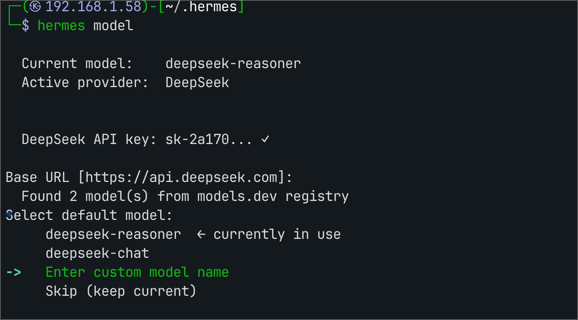
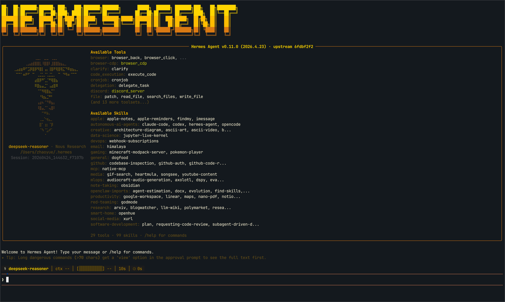
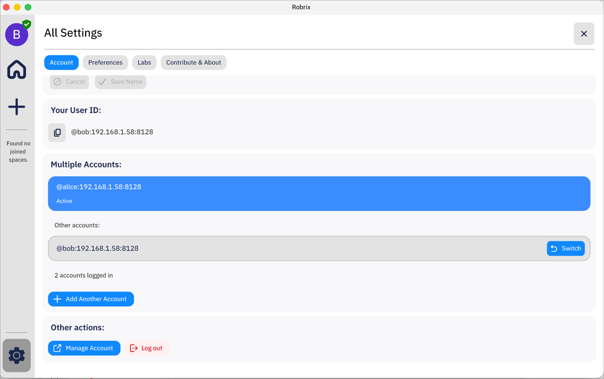
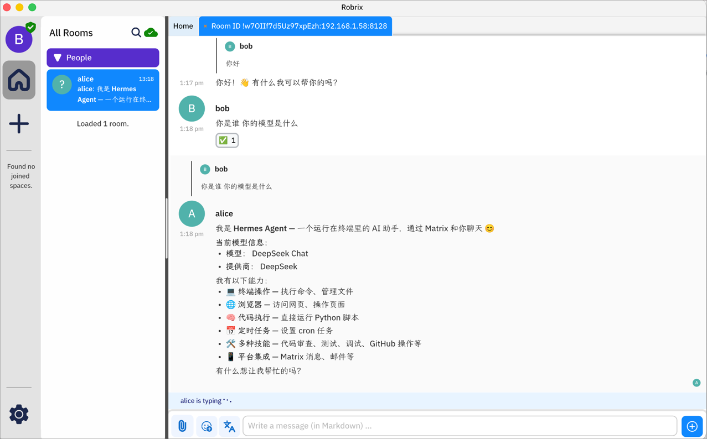

# 部署指南：Hermes Agent + Matrix

[English](01-deploying-hermes-with-matrix.md)

> **目标：** 读完本指南，你将能在 Robrix 里和 [Hermes Agent](https://github.com/NousResearch/Hermes-Agent) 直接对话。

## 什么是 Hermes Agent？

[Hermes Agent](https://github.com/NousResearch/Hermes-Agent) 是 [Nous Research](https://nousresearch.com/) 开源的自托管 AI 代理框架，特点是原生围绕 function calling 和工具调用设计。它可以对接多家 LLM（Nous Portal、OpenAI、Anthropic、Gemini、DeepSeek 等），并通过统一的消息网关接入 Matrix、Telegram、Discord、WhatsApp 等聊天平台。在本指南中，Hermes 通过其**内置的 Matrix 适配器**以**普通用户身份**登录 homeserver，不需要任何服务器端配置——和 OpenClaw 的接入方式属于同一类"作为普通 Matrix 客户端"的路线，两者都可以被 Robrix 直接看见并对话。

## 本指南的定位

本指南聚焦把 Hermes bot **在本地环境里完整跑起来**的路径：先装好 Hermes，再让它以普通用户身份登录你的 Matrix 服务器，最后在 Robrix 里和它交流。顺带把这对组合下**常见问题**讲清楚——比如本地 Palpo 的连接地址和账号后缀可能不一样。

Hermes 自身更深入的用法（完整的环境变量、Session Model、其他消息平台、加密进阶）官方文档讲是最佳指南，建议先阅读官方文档做准备

- **Hermes 官方文档：** [hermes-agent.nousresearch.com/docs](https://hermes-agent.nousresearch.com/docs/)
- **Matrix 适配器专章：** [messaging/matrix](https://hermes-agent.nousresearch.com/docs/user-guide/messaging/matrix)
- **Hermes GitHub：** [github.com/NousResearch/Hermes-Agent](https://github.com/NousResearch/Hermes-Agent)

本指南基于 Hermes v0.11.0（2026 年 4 月）+ 本地 Palpo + macOS arm64 实测。Hermes 迭代较快，后续版本如果字段或命令和本文不一样，以官方文档为准。

---

## 目录

1. [前置条件](#1-%E5%89%8D%E7%BD%AE%E6%9D%A1%E4%BB%B6)
2. [安装并配置 Hermes](#2-%E5%AE%89%E8%A3%85%E5%B9%B6%E9%85%8D%E7%BD%AE-hermes)
3. [让 Hermes 登录 Matrix](#3-%E8%AE%A9-hermes-%E7%99%BB%E5%BD%95-matrix)
4. [在 Robrix 里测试](#4-%E5%9C%A8-robrix-%E9%87%8C%E6%B5%8B%E8%AF%95)
5. [遇到问题看哪里](#5-%E9%81%87%E5%88%B0%E9%97%AE%E9%A2%98%E7%9C%8B%E5%93%AA%E9%87%8C)
6. [延伸阅读](#6-%E5%BB%B6%E4%BC%B8%E9%98%85%E8%AF%BB)

---

## 1. 前置条件

| 条件 | 说明 |
| --- | --- |
| **Matrix 服务器** | 本地 Palpo（[部署指南](../robrix-with-palpo-and-octos/01-deploying-palpo-and-octos-zh.md)）、matrix.org、自建 Synapse 都行 |
| **Robrix** | [Robrix 快速开始](../robrix/getting-started-with-robrix-zh.md) |
| **两个 Matrix 账号** | 一个是你自己，另一个给 Hermes bot 用 |
| **一个 LLM API Key** | [DeepSeek](https://platform.deepseek.com/api_keys)、Nous Portal、OpenAI、Anthropic 等，任选 |

Hermes 本身我们下一章现装，不用预装。

---

## 2. 安装并配置 Hermes

这一章的目标：让 Hermes 跑起来并能调到 LLM。还不涉及 Matrix。

### 2.1 一键安装

```bash
curl -fsSL https://raw.githubusercontent.com/NousResearch/hermes-agent/main/scripts/install.sh | bash
```

安装脚本会下 Python 3.11、建 venv、装依赖、把 `hermes` 命令软链接到 `~/.local/bin/hermes`。装完后重开一个终端，或者 `source ~/.zshrc`（bash 用户换成 `~/.bashrc`）让 `hermes` 命令进 PATH。

安装遇到问题，看 [Hermes 官方安装文档](https://hermes-agent.nousresearch.com/docs/getting-started/installation) 或 [GitHub Issues](https://github.com/NousResearch/Hermes-Agent/issues)。

### 2.2 验证装好了

```bash
hermes --version   # 期待: Hermes Agent v0.11.x
```

### 2.3 配一个 LLM（以 DeepSeek 为例）

```bash
hermes setup
```

向导会让你贴 API key（`sk-xxxx` 格式，从 [DeepSeek 控制台](https://platform.deepseek.com/api_keys) 拿），写到 `~/.hermes/.env`。

其他 provider 的用法直接看 `hermes --help`。

### 2.4 可选：设默认模型

```bash
hermes model
```

不带参数会进交互菜单，列表里是 registry 识别到的模型（目前是 `deepseek-reasoner` 和 `deepseek-chat`），另外有一个 **Enter custom model name** 选项，可以手工输入任意模型 ID——DeepSeek 发新模型（比如 `deepseek-v4`）registry 还没跟上时从这个入口填就行。



具体模型 ID 以 DeepSeek [模型与定价文档](https://api-docs.deepseek.com/zh-cn/quick_start/pricing) 为准——Hermes 不做白名单，你填什么就透传给 DeepSeek API。

到这里 §2 就告一段落。想在接 Matrix 之前先验一下 LLM 通不通，可以直接跑 `hermes agent`——看到下面这个 splash（Tools / Skills 列出来、左下角显示 `deepseek-reasoner`、底部能输入对话），说明 Hermes 本体加 LLM 这条链路已经没问题，可以进入 §3 把 Matrix 接进来。



---

## 3. 让 Hermes 登录 Matrix

Hermes 已经装好了，下面让它以一个普通用户的身份登录到你的 Matrix 服务器。

### 3.1 在 Robrix 里给 Hermes 建个账号

这一步就是在 Matrix 服务器上注册一个普通账号，取个名字给 Hermes 用。最简单的方式是直接在 Robrix 里做：


| 你的 Matrix 服务器 | 怎么注册 |
| --- | --- |
| 本地 Palpo | 在 Robrix 里填 `http://127.0.0.1:8128`，用注册页新建一个账号 |
| matrix.org | 在 Robrix 或 [Element Web](https://app.element.io) 里注册 |
| 自建 Synapse | Admin API 或服务器提供的注册页 |

注册时记下 **用户名** 和 **密码**。

> **如果你用本地 Palpo，顺便看一下 §3.2 这个小坑——一句话说，你在客户端连 Palpo 时填的地址，和账号后缀里的那个地址，可能不是同一个。** 公网域名的部署不会遇到这个问题。

### 3.2 本地 Palpo 的一个小坑：连接地址 ≠ 账号后缀

这个坑不是 Hermes 引起的，是 Matrix-id 设计取舍，但因为 Hermes 的配置里**同时会问你"homeserver 地址"和"完整 user_id"**，你需要知道这两个值可能是不一样的。

概念上：

- **homeserver 地址** = 你用来连接 Palpo 的 URL，比如 `http://127.0.0.1:8128`
- **账号后缀**（Matrix 管它叫 `server_name`）= 你的 Matrix ID 里冒号后面那一串字符，Palpo 启动时在配置里自己声明的"身份"

三种常见情况：

| Palpo 配置里的 `server_name` | 客户端连 Palpo 用的 URL | 注册出来的账号长这样 | 两个地址是否一致 |
| --- | --- | --- | --- |
| `127.0.0.1:8128` | `http://127.0.0.1:8128` | `@hermes-bot:127.0.0.1:8128` | ✓ 一致 |
| `192.168.1.28:8128`（LAN IP） | `http://127.0.0.1:8128` | `@hermes-bot:192.168.1.28:8128` | ✗ **不一致** |
| `matrix.example.com`（域名） | `https://matrix.example.com` | `@hermes-bot:matrix.example.com` | ✓ 一致 |

**第二种最容易混淆**——你用 `127.0.0.1` 能连上 Palpo 并成功注册，但注册出来的账号其实是带 LAN IP 的。所以下一步配 Hermes 时：

- 填 homeserver 地址 → 用 `http://127.0.0.1:8128`（你本机连得上的那个）
- 填 user ID → 用 `@hermes-bot:192.168.1.28:8128`（账号真正的样子）

两个地址**故意写得不一样**是正常的。

> 不确定自己账号id？在 Robrix 登录后去 Profile / Settings 页面，显示的 `@xxx:yyy` 就是完整的。



### 3.3 跑 Matrix 配置向导

回到命令行：

```bash
hermes gateway setup
```

选 Matrix 之后，向导会先印一段 Matrix 接入的背景说明（包含怎么用 Element 或 `curl` 拿 access token 的命令），然后问你两件事：

- **Homeserver URL**：填你的 Matrix 服务器地址。本地 Palpo 填 `http://127.0.0.1:8128`  如果是其他服务，填上matrix服务的域名等
- **Access token**：贴你的 access token；如果你想用"用户名 + 密码"登录，这里留空

如果你选了**留空走密码登录**，向导这一阶段就结束了，把 homeserver 写进了 `~/.hermes/.env`。剩下的用户名、密码、白名单等需要你自己打开 `~/.hermes/.env` 补上。本地 Palpo 场景下一个能跑的最小配置：

```bash
# ~/.hermes/.env
MATRIX_HOMESERVER=http://127.0.0.1:8128
MATRIX_USER_ID=@hermes-bot:192.168.1.28:8128       # 参考 §3.2 看 server_name 后缀
MATRIX_PASSWORD=your-bot-password
MATRIX_ALLOWED_USERS=@your-personal-account:192.168.1.28:8128
```

> **用的是 matrix.org？** 把 homeserver 换成 `https://matrix.org`、user_id 换成 `@hermes-bot:matrix.org`，其余一样。

是否要求 @mention、是否启用加密、主房间等其他可配置项，完整清单看 [Hermes Matrix 文档](https://hermes-agent.nousresearch.com/docs/user-guide/messaging/matrix)。

### 3.4 启动 gateway，以及装 Matrix 库的一个小插曲

启动：

```bash
hermes gateway
```

**成功长这样**——日志里会出现：

```
┌─────────────────────────────────────────────────────────┐
│           ⚕ Hermes Gateway Starting...                 │
├─────────────────────────────────────────────────────────┤
│  Messaging platforms + cron scheduler                    │
│  Press Ctrl+C to stop                                   │
└─────────────────────────────────────────────────────────┘

load: 2.11  cmd: python3.11 46130 waiting 0.43u 0.09s
```

**大概率第一次会看到这条警告**：

```
WARNING Matrix: mautrix not installed. Run: pip install 'mautrix[encryption]'
```

意思是 Matrix 适配器需要的 Python 库还没装。Hermes 的 venv 是用 uv 建的（默认不带 pip），所以要这样装：

```bash
uv pip install --python ~/.hermes/hermes-agent/venv/bin/python 'mautrix[encryption]'
```

装上之后重新 `hermes gateway`，应该就能看到上面那成功日志了。

> **装不上加密版？** `mautrix[encryption]` 里有个叫 `python-olm` 的依赖，在一些系统上（尤其 macOS 新版 + CMake 4+）目前装不太动。遇到这种情况先装明文版救急：
>
> ```bash
> uv pip install --python ~/.hermes/hermes-agent/venv/bin/python mautrix
> ```
>
> 这条一定能装上，代价是加密房间里 Hermes 看不到消息。这是 mautrix-python 的上游依赖问题，去 [mautrix/python](https://github.com/mautrix/python/issues) 那边追更方便。明文版也不耽误你先跑通流程——测试时用非加密的公共房间就好（下一章会讲）。

### 3.5 一个常见问题

测试前先提前说一下。

**一定要把你自己加进** `MATRIX_ALLOWED_USERS`

Hermes 默认只回答白名单里的人。**你本人**给 Hermes 发消息，如果你的 Matrix ID 不在 `MATRIX_ALLOWED_USERS` 里，Hermes 是不会有回应的。

向导里那个 Allowed users 填的就是这个。手写 `.env` 的话是：

```
MATRIX_ALLOWED_USERS=@your-personal-account:192.168.1.28:8128
```

---

## 4. 在 Robrix 里测试

1. 用**你自己的账号**（不是 bot）登录 Robrix
2. 搜索刚才配置给hermers-agent用的matrix-id
3. 注意输入 bot 完整 ID，例如 `@hermes-bot:192.168.1.28:8128`
4. Bot 会自动接受邀请，几秒内出现在成员列表
5. 发一条消息试试
6. 等 LLM 回你（几秒到几十秒）

能收到回复，就说明 Robrix 和 Hermes 已经端到端通了。



---

## 5. 遇到问题看哪里

下表按问题的来源分类，大多数问题都不在 Robrix 这一侧，所以"去哪里解决"一列才是重点。

| 症状 | 问题出在哪 | 去哪里解决 |
| --- | --- | --- |
| 安装脚本卡住、\`curl | bash\` 早期就失败 | Hermes 安装流程 |
| 启动报 `mautrix not installed` / `No adapter available` | Matrix 库没装 | §3.4 的 `uv pip install` 那条命令 |
| `python-olm` 装不上、CMake 报错、找不到 libolm | mautrix 上游依赖 | [mautrix/python](https://github.com/mautrix/python/issues)；先用明文版救急（§3.4） |
| 启动报 LLM 鉴权错、模型不存在、余额不足 | LLM provider 侧 | 对应 provider 的控制台 |
| 启动报 `Matrix: connection refused` / 拒绝连接 | Matrix 服务器没开 | 确认 Palpo / 你的 homeserver 在线，地址填对没 |
| 启动报 `Matrix: login failed: M_FORBIDDEN` | 账号或密码不对 | 对照 §3.2 看一下 user_id 里的 `server_name` 是不是和 Palpo 声明的一致 |
| bot 收到消息不回（日志没错误） | 没加白名单 | §3.5——把你自己的 user_id 加进 `MATRIX_ALLOWED_USERS` |
| 私聊里 bot 收不到消息 | 加密库没装，明文模式不能解密 | §3.4——换非加密房间测，或装好加密版 mautrix |
| Robrix 搜不到 bot 账号 | 账号没注册成功 | 用 bot 账号去 Element Web 登一下验证它真的存在 |
| Hermes 其他奇怪行为（CLI 崩溃、gateway 状态态异常、tool 调用错乱） | Hermes 本身 | [Hermes 官方文档](https://hermes-agent.nousresearch.com/docs/) / GitHub Issues |

> **一个粗略的判断方法**：问题出现在"Hermes 启动阶段"或"Hermes 打的日志里"的，优先去 Hermes 那边查；出现在"Robrix 看到/看不到消息"这一层的，再回本指南对照。

---

## 6. 延伸阅读

- **Hermes 官方文档：** [hermes-agent.nousresearch.com/docs](https://hermes-agent.nousresearch.com/docs/)
- **Hermes Matrix 适配器专章：** [messaging/matrix](https://hermes-agent.nousresearch.com/docs/user-guide/messaging/matrix)——完整的环境变量、Session Model、加密进阶、proactive messages 等
- **Hermes GitHub：** [github.com/NousResearch/Hermes-Agent](https://github.com/NousResearch/Hermes-Agent)
- **Palpo 部署指南：** [01-deploying-palpo-and-octos-zh.md](../robrix-with-palpo-and-octos/01-deploying-palpo-and-octos-zh.md)
- **OpenClaw 对照指南：** [01-deploying-openclaw-with-matrix-zh.md](../robrix-with-openclaw/01-deploying-openclaw-with-matrix-zh.md)——OpenClaw 走的是同一种"普通 Matrix 用户"的接入模式，细节可以互相印证
- **OpenClaw 使用指南（对 Hermes 也适用）：** [02-using-robrix-with-openclaw-zh.md](../robrix-with-openclaw/02-using-robrix-with-openclaw-zh.md)——Robrix 这一侧对任何"以普通 Matrix 用户身份登录"的 bot 看到的 UX 都一样（DM 流程、把 bot 拉进房间、@mention 行为），所以这份也覆盖了 Hermes 的日常使用
- **Robrix × OpenClaw 架构原理：** [03-how-robrix-and-openclaw-work-together-zh.md](../robrix-with-openclaw/03-how-robrix-and-openclaw-work-together-zh.md)——这份讲的是"AI agent 作为普通 Matrix 客户端"的通用原理，对 Hermes 完全适用

---

*本指南基于 Hermes Agent v0.11.0（2026 年 4 月）实测。Hermes 迭代较快，字段和命令可能变化，遇到和本文对不上的地方以 [Hermes 官方文档](https://hermes-agent.nousresearch.com/docs/) 为准。*